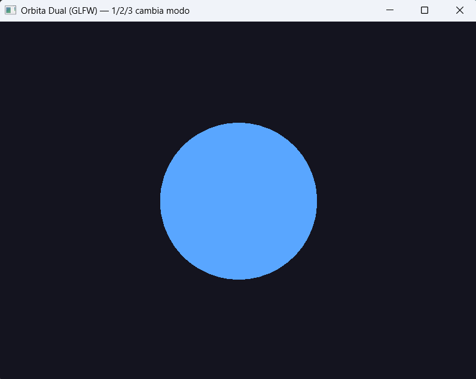
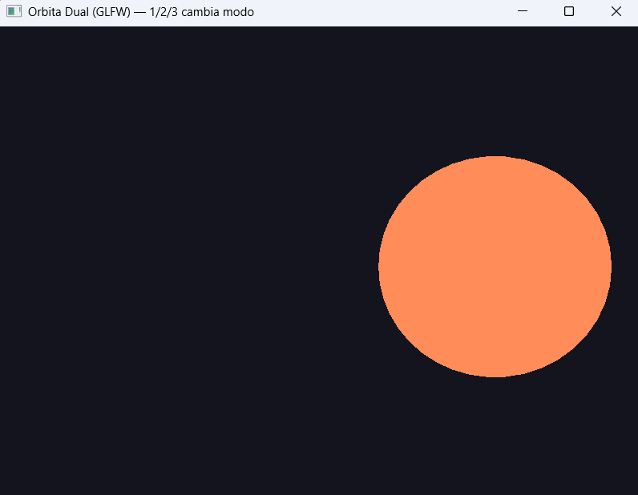
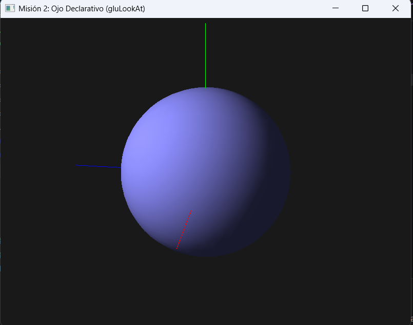
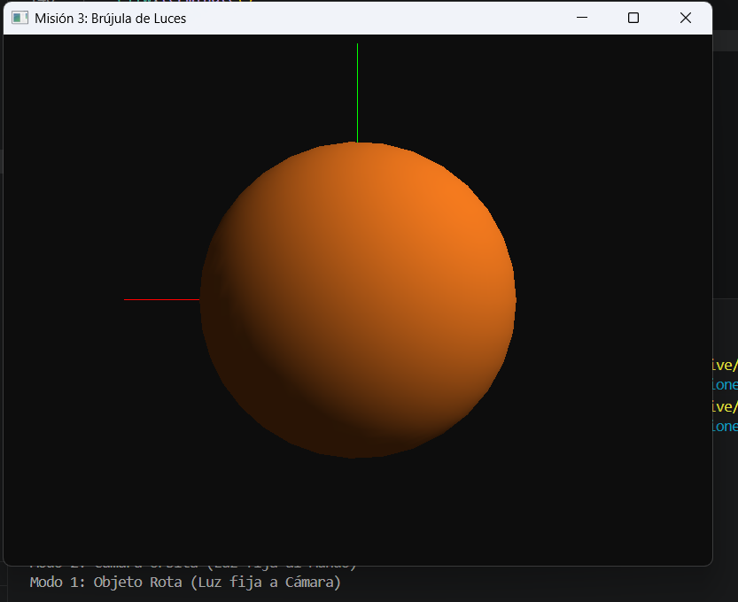

# Reporte de Misión: Órbita Dual (Cámara vs Objeto)
**Agente Especial:** Sánchez Hernández Estrella Abigail / 24120345

---
## Evidencias
### Misión 1
- Objeto rota:
- Cámara orbita:
- Código: El proporcionado en clase 

### Misión 2
- LookAt órbita: 

### Misión 3 (opcional)
- Luces: 

---
## Análisis del Analista (Reflexiones Finales)

1. **Orden de matrices:** ¿Por qué en OpenGL fijo el orden en que escribes =glTranslatef= / =glRotatef= cambia el resultado aunque uses los mismos números?
> [Porque OpenGL multiplica las matrices en orden inverso, así que cambiar el orden de glTranslatef y glRotatef modifica completamente el resultado final de la transformación.]

2. **Objeto vs cámara:** En la práctica, ¿cuándo prefieres rotar el modelo y cuándo orbitar la cámara?
> [Rotar el objeto es útil para inspeccionar modelos. Orbitar la cámara es mejor para explorar escenas y generar una sensación de movimiento alrededor del objeto.]

3. **gluLookAt vs translate+rotate:** ¿Qué ventaja tiene describir la cámara con ojo–objetivo–arriba para equipos de desarrollo?
> [gluLookAt facilita describir la cámara mediante posición, objetivo y vector arriba, haciendo el código más claro y fácil de mantener en equipos de desarrollo.]

4. **Luces:** Si la luz se define en el frame de la cámara sin reubicarla al mundo, ¿qué artefacto visual esperas al rotar solo el objeto?
> [Si la luz permanece en coordenadas de cámara mientras solo rota el objeto, las sombras y reflejos parecen deslizarse sobre la superficie del modelo de forma poco realista.]